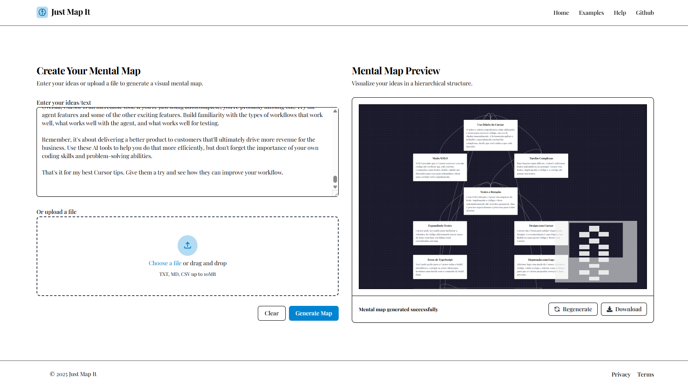

# Just Map It

A web application for creating and visualizing concept maps and knowledge graphs. Built with Vue.js and Node w/ Typescript.

## Overview

Just Map It helps users create, visualize, and manage concept maps and knowledge graphs. It provides an intuitive interface for mapping ideas, concepts, and their relationships.

## Features

- Create and edit concept maps with an intuitive UI
- Visualize knowledge graphs with Vue Flow
- Export and import your maps
- AI-powered suggestions for map creation (using OpenAI integration)

## Tech Stack

### Client
- Vue.js w/ TypeScript
- Vue Flow

### Server
- Node.js w/ TypeScript
- MongoDB
- OpenAI API

## Contributing

Contributions are welcome! Please feel free to submit a Pull Request.

1. Fork the repository
2. Create your feature branch ( git checkout -b feature/amazing-feature )
3. Commit your changes ( git commit -m 'Add some amazing feature' )
4. Push to the branch ( git push origin feature/amazing-feature )
5. Open a Pull Request

## License
This project is licensed under the MIT License - see the LICENSE file for details.